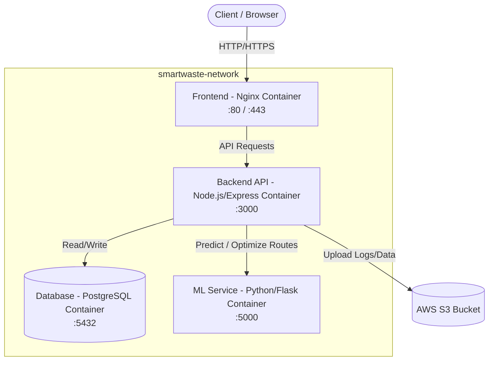

# SmartWaste Cloud - Project Architecture

This document describes the high-level architecture of the SmartWaste Cloud application based on the current microservices and Docker setup.

## High-Level Architecture Diagram

## System Components

### 1. Frontend (Nginx)
- **Tech Stack:** HTML5, CSS3, Vanilla JavaScript.
- **Role:** Presents the user interface for dashboards, map views, login/signup, and routing.
- **Containerization:** Hosted via an Nginx web server, which serves the static assets from the `frontend/` directory and exposes ports 80 and 443.

### 2. Backend API (Node.js/Express)
- **Tech Stack:** Node.js, Express.js.
- **Role:** Acts as the central brain of the application. It handles routing, user authentication, bin status monitoring, and interfaces with both the database and the ML service.
- **Key Modules:**
  - `controllers/` & `routes/`: Manages endpoints for auth, bins, and routes.
  - `services/`: Contains core business logic (e.g., `alertService`, `predictionService`, `routeService`).
  - `AWS Integration`: Uses AWS SDK (`s3.js`) to interact with an AWS S3 bucket for logging or external file storage.

### 3. Machine Learning Service (Python/Flask)
- **Tech Stack:** Python, Flask.
- **Role:** A dedicated microservice designed to provide advanced analytics. Currently, it exposes stubbed endpoints (`/predict` and `/optimize-route`) which return simulated data. Eventually, this will host the actual predictive models (e.g., forecasting bin overflow times) and route optimization algorithms (like TSP).

### 4. Database (PostgreSQL)
- **Tech Stack:** PostgreSQL.
- **Role:** Relational database storing persistent data such as user credentials, bin statuses, historical data, and configurations.
- **Initialization:** Bootstrapped via `schema.sql` and `seed.sql` provided in the `database/` directory via Docker volumes.

### 5. Cloud Services
- **AWS S3:** Used for scalable object storage. Configured in the backend via environment variables (`AWS_ACCESS_KEY_ID`, `AWS_BUCKET_NAME`, etc.) to store application logs (e.g., `smartwaste-logs-599081565356-ap-south-1-an`).

## Deployment Architecture

The entire application state is containerized using **Docker** and orchestrated via **Docker Compose**:
- **Isolation:** Each component (Frontend, Backend, Database, ML) runs in its own isolated container.
- **Networking:** All containers communicate securely over a shared Docker bridge network (`smartwaste-network`).
- **Data Persistence:** PostgreSQL data is persisted using a local Docker volume (`smartwaste_db_data`), ensuring that database records survive container restarts.
